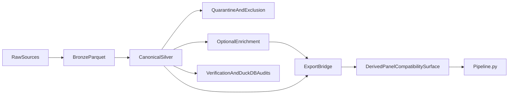

# Canonical Market Data And Research Pipeline

Repository: [https://github.com/cammcnally/new](https://github.com/cammcnally/new)

This repository now has two explicit layers:

1. `market_data` is the canonical market-data platform and source of truth.
2. `Pipeline.py` is the downstream Phase 1 research pipeline that consumes a derived/exported compatibility surface.

The repo's center of gravity is no longer a panel CSV. The panel export exists so the downstream research system can continue to run while canonical data contracts, verification, and bridge surfaces are hardened.

## Authority

Current governing references live in:

- `AGENTS.md`
- `docs/data_contract.md`
- `docs/phase1-research-spec.md`
- `docs/phase1-execution-roadmap.md`
- `docs/governance/REPO_AUTHORITY_POLICY.md`
- `config/canonical/repo_authority.yaml`

Deferred target-state specification references live in:

- `docs/specs/CANONICAL_INSTALLATION_DIRECTIVE.md`
- `docs/specs/CANONICAL_DAILY_CROSS_SECTIONAL_EQUITY_ALPHA_SPEC.md`
- `docs/governance/CHANGE_CONTROL.md`
- `docs/governance/ACCEPTANCE_GATES.md`
- `docs/end_to_end_trading_system_architecture.md`

Authority boundaries:

- `docs/data_contract.md` is normative for the market-data layer.
- `docs/phase1-research-spec.md` and `docs/phase1-execution-roadmap.md` are normative for downstream Phase 1 research semantics.
- `docs/governance/REPO_AUTHORITY_POLICY.md` plus `config/canonical/repo_authority.yaml` govern repo-authority enforcement, generated-surface discipline, frozen-boundary policy, and demotion checks.
- `docs/specs/CANONICAL_INSTALLATION_DIRECTIVE.md` is a deferred target-state specification for installation, environment, dependency-policy interpretation, file-structure guidance, runtime-path guidance, and target-state architecture routing. It does not supersede higher-priority authority.
- `docs/specs/CANONICAL_DAILY_CROSS_SECTIONAL_EQUITY_ALPHA_SPEC.md` is a deferred target-state specification for the future downstream alpha stack. It does not by itself replace current `Pipeline.py` behavior.
- `docs/end_to_end_trading_system_architecture.md` is the broader explanatory blueprint for future-state downstream design and should defer to the deferred spec surfaces above.
- `README.md` is the operator-facing architecture and workflow guide. It must stay synchronized with code and contract changes.

If these surfaces disagree, follow the tighter authority boundary first: `AGENTS.md`, `docs/data_contract.md`, `docs/phase1-*.md`, `docs/governance/REPO_AUTHORITY_POLICY.md`, and current `Pipeline.py` behavior outrank the deferred target-state specs. The deferred target-state specs outrank lower-precedence summaries such as `README.md`, `docs/implementation_runbook.md`, `market_data/COMMANDS.md`, and `docs/end_to_end_trading_system_architecture.md` within their declared scope. Update the stale document rather than inferring a new architecture from outdated text.

Poetry remains deferred and not authoritative in the current repo state. The implemented runtime layout remains `market_data/` plus top-level `Pipeline.py`, while any `pipeline/`-first decomposition remains target-state guidance only.

**Platform authority:** Linux CI is the canonical release authority. Windows may be used for development. WSL is the preferred local parity environment for agent-driven work and final validation.

## Architecture



### Canonical Market-Data Layer

The canonical market-data platform owns:

- instrument identity
- source symbol mapping
- daily prices
- macro vintage storage and as-of materialization
- benchmark semantics
- verification and manifests
- export bridge generation

The simplest supported build story is:

1. bronze preserves raw source truth
2. silver decides canonical correctness, PIT, and quarantine
3. gold and export publish only validated downstream-compatible surfaces

Primary repo surfaces:

- `market_data/common/`
- `market_data/raw/`
- `market_data/bronze/`
- `market_data/silver/`
- `market_data/gold/`
- `market_data/qa/`
- `market_data/bridge/`
- `market_data/orchestration/`

### Downstream Research Layer

The downstream research pipeline owns:

- feature engineering
- labels
- walk-forward and CPCV-style validation logic
- model training and calibration
- threshold search
- portfolio simulation
- robustness reporting
- promotion logic

Primary repo surfaces:

- `Pipeline.py`
- `feature_registry/`
- `mlflow_integration/`
- `tools/phase1_sanity_check.py`
- `tests/test_phase1_*.py`

## Source-Of-Truth Rules

- `market_data` is the documented and enforced source of truth for data architecture.
- `instrument_master` is canonical.
- `instrument_symbol_history` is canonical.
- required-core data determines canonical export readiness.
- optional enrichments may improve context but must not become hidden authorities.
- `security_master` is compatibility-only.
- `security_master` must be auto-generated from canonical identity tables and treated as read-only compatibility output.
- `Pipeline.py` must keep working through the export/compatibility bridge until all downstream consumers are migrated.
- `config/canonical/` holds the repo-authority registry, frozen-boundary hashes, and deferred target-state mirrors; it must never supersede `AGENTS.md`, the frozen Phase 1 docs, or current implemented `Pipeline.py` behavior.
- Macro joins must be point-in-time safe.
- Canonical exports must satisfy both entity-PIT and time-PIT.
- Benchmark/reference instruments must carry explicit semantic roles.
- `VIXY` must never be treated as equivalent to `^VIX`.
- Sector-relative features remain disabled unless valid date-effective classification support exists.

## Surface Status

### Canonical / Authoritative

- `market_data/*`
- `docs/data_contract.md`
- market-data verification entrypoints under `tools/`
- `AGENTS.md`
- Phase 1 normative docs under `docs/phase1-*.md`
- `docs/specs/*.md` for deferred target-state specifications
- `docs/governance/*.md` for repo-authority policy plus deferred target-state change control and acceptance gates
- `config/canonical/*` for the machine-readable authority registry, frozen-boundary hashes, and deferred target-state mirrors

### Compatibility-Only

- `market_data/silver/security_master`
- `market_data/bridge/export_pipeline_panel.py`
- panel CSV exports such as `panel_ohlcv_clean.csv`
- any legacy adapter that exists only to preserve `Pipeline.py` or other old consumers

### Generated

- `.cursor/*`
- `contracts/*.lock.json`
- loader/projection manifests
- generated compatibility exports and manifests written by the runtime

### Optional / Secondary

- `mlflow_integration/`
- `lineage/`
- narrow `dvc.yaml` tracking the compatibility export (`panel_ohlcv_clean.csv` + sidecar manifest) via `tools/run_repo_e2e.py --stop-after export_panel` (not broad `pipeline_outputs/*` snapshots)
- `gx/` for top-level artifact validation where still useful
- `docs/end_to_end_trading_system_architecture.md` as the consolidated target-state downstream architecture blueprint

### Deferred But Planned

- authoritative historical classification membership
- broader fundamentals PIT coverage
- broader orchestration refactor or asset-graph migration
- broader DVC expansion
- expanded Dagster role
- Prefect
- lakeFS
- broad MCP expansion

See `docs/market_data_roadmap.md` for revisit conditions.

## Valid Claims Today

The repo may claim:

- the market-data layer is the intended canonical source of truth
- the research pipeline consumes a derived/exported compatibility surface
- downstream Phase 1 semantics remain frozen unless changed through the normative governance path
- threshold-family correction remains limited to the existing Phase 1 boundary
- the repo now carries a consolidated target-state architecture blueprint for broader downstream trading-system integration in `docs/end_to_end_trading_system_architecture.md`

The repo may not claim:

- that all planned canonical tables are fully populated and decision-grade
- that sector-relative classification logic is historically valid
- that all deferred PIT domains are complete
- that any downstream model or backtest result is comparable without a concrete dataset/export build reference

## Market-Data Contract And Verification

### PIT Disciplines

The repo now treats PIT as two separate but mandatory laws:

- `entity-PIT`: every exported row must resolve to the correct economic entity through canonical identity and date-effective source-symbol mapping
- `time-PIT`: every exported row or enrichment must be eligible by the canonical session/public-availability cutoff

The canonical build fails closed if either discipline is violated for exported data.

### Required-Core And Optional-Enrichment

The canonical market-data layer now distinguishes between:

- `required-core`: identity, source-symbol mapping, OHLCV, session correctness, required benchmark/reference coverage, and export-safe compatibility labeling
- `optional-enrichment`: macro, SEC/fundamentals, and other non-blocking enrichments that remain nullable and flagged when absent

This is a simplification rule, not a second framework. Required-core drives export safety. Optional-enrichment may extend the export surface only when its own domain PIT rules are satisfied.

### Export Safety

Canonical export readiness means more than “QA had no fatal error”. A safe export must:

- exclude or quarantine unresolved required-core rows
- fail closed when compatibility fallback was used in canonical eligibility
- carry `dataset_build_id` and `export_panel_version_id`
- write coverage, unresolved-identity, quarantine, and final-status artifacts truthfully

Read `docs/data_contract.md` before changing:

- schema
- PIT logic
- benchmark semantics
- compatibility bridge behavior
- export contracts
- orchestration critical path

Highest-priority controls for this repo:

1. Pandera contracts on canonical and bridge surfaces
2. repo rules and hooks for `market_data` changes
3. synchronized docs (`README.md` and `docs/data_contract.md`)
4. reproducible export manifests and build IDs
5. disciplined DuckDB + Parquet conventions
6. MLflow tied to dataset/export build IDs
7. narrow DVC for reproducibility-critical exports only

## Phase 1 Research Boundary

This work does **not** broaden downstream research claims.

The Phase 1 non-negotiables remain:

- `threshold_search_corrected = true`
- `full_pipeline_corrected = false`
- `trial_scope_formal = threshold_policy_search_only`
- `trial_count_formal = 108`
- `max_concurrent = 8` is a cap, not a target
- occupancy is diagnostic only
- ranking-map guardrail failures invalidate a run

If you need to change those meanings, update `docs/phase1-research-spec.md` first.

## Repository Layout

| Path | Role |
| ---- | ---- |
| `market_data/` | Canonical data platform: ingest, normalize, build, verify, export |
| `Pipeline.py` | Downstream Phase 1 research pipeline |
| `docs/data_contract.md` | Normative data-layer contract |
| `docs/phase1-research-spec.md` | Normative downstream research semantics |
| `docs/phase1-execution-roadmap.md` | Ordered Phase 1 execution roadmap |
| `docs/specs/` | Deferred target-state installation and alpha specifications |
| `docs/governance/` | Repo-authority policy plus deferred target-state change control and acceptance gates |
| `config/canonical/` | Machine-readable authority registry, frozen-boundary hashes, and deferred target-state mirrors |
| `docs/market_data_roadmap.md` | Deferred tooling and revisit conditions |
| `tests/market_data/` | Market-data unit and contract tests |
| `tests/test_phase1_*.py` | Downstream Phase 1 helper and smoke tests |
| `tools/` | Verification, sanity-check, and control-plane entrypoints |
| `.github/workflows/` | CI and reusable verification workflows |
| `.codex/hooks.json` | Local automation hooks |

## Setup

### Core Development Environment

```bash
uv sync --group dev --group control-plane --group ingestion --group ingestion-test
```

Additional optional groups:

```bash
uv sync --group dev --group control-plane --group ingestion --group ingestion-test --group ml --group data --group lineage --group orchestrator
```

Factor diagnostics (optional): add `--group analysis` to install pinned `alphalens-reloaded` for `analysis/alpha_diagnostics/` exports and `tests/analysis/`.

The canonical export bridge now writes a benchmark side artifact next to the panel CSV, advertised through the panel manifest under `side_artifacts.benchmark_surface_daily`. `Pipeline.py` reads that manifest metadata rather than guessing benchmark paths.

## Common Workflows

### 1. Run The Authoritative Local E2E Flow

```powershell
make e2e
uv run python tools/run_repo_e2e.py
uv run python tools/run_repo_e2e.py --resume
uv run python tools/run_repo_e2e.py --from-stage verify_market_data
uv run python tools/run_repo_e2e.py --stop-after export_panel
```

This is the canonical local operator path. It:

- syncs required dependency groups
- refreshes canonical market-data state through the shared raw -> bronze -> silver -> gold -> QA path
- writes `data_lake/manifests/dataset_manifest.json`
- writes coverage, unresolved-identity, quarantine, and final-status reports under `data_lake/`
- enforces docs-sync, contract, PIT, compat, and bridge gates
- exports `panel_ohlcv_clean.csv` plus a verified sidecar manifest
- runs `Pipeline.py`
- writes e2e state and status artifacts under `data_lake/manifests/`

### 2. Bootstrap Or Sync Canonical Data

```powershell
.\.venv\Scripts\python.exe -m market_data.cli bootstrap --start-date 2010-01-01
.\.venv\Scripts\python.exe -m market_data.cli sync
```

### 3. Export The Compatibility Surface

```powershell
.\.venv\Scripts\python.exe -m market_data.cli export-latest --output panel_ohlcv_clean.csv
.\.venv\Scripts\python.exe -m market_data.cli export-asof --asof-date 2026-01-15 --output panel_ohlcv_clean.csv
```

Each export should carry a sidecar manifest at `<panel>.manifest.json` with `dataset_build_id` and `export_panel_version_id`.
The bridge now fails closed unless the dataset manifest marks the canonical build `canonical_export_ready = true` and `compatibility_fallback_used = false`.
Direct `Pipeline.py` runs are valid only when that sidecar exists and carries both build references.

### 4. Run The Downstream Research Pipeline

```powershell
.\.venv\Scripts\python.exe Pipeline.py `
  --input_panel_csv panel_ohlcv_clean.csv `
  --output_dir pipeline_outputs `
  --strategy_report_template strategy-report.qmd
```

### 5. Resume The Downstream Run

```powershell
.\.venv\Scripts\python.exe Pipeline.py `
  --input_panel_csv panel_ohlcv_clean.csv `
  --output_dir pipeline_outputs `
  --strategy_report_template strategy-report.qmd `
  --resume
```

Resume requires the same effective input and output directory. The downstream pipeline remains responsible for its own Phase 1 fingerprinting and resume checks.

When the optional `lineage` dependency group is installed and file-backed lineage emission succeeds, downstream runs also write:

- `pipeline_outputs/06_state/lineage_summary.json`
- file-backed OpenLineage events under `pipeline_outputs/06_state/lineage_events/`

These lineage artifacts carry the same `dataset_build_id` and `export_panel_version_id` references as the export manifest and MLflow tags.

### 6. Render The Canonical Strategy Report Template

The canonical Quarto source template is:

- `strategy-report.qmd`

Pipeline artifacts now record this path in:

- `pipeline_outputs/02_metrics/overall_metrics.json` (`strategy_report_template_path`)
- `pipeline_outputs/05_reports/strategy_report_template_path.txt`
- `pipeline_outputs/06_state/config_snapshot.json` (`strategy_report_template`)

Install reporting dependencies (Python + Quarto CLI):

```powershell
.\.venv\Scripts\python.exe -m pip install jupyter ipykernel marimo
winget install --id Posit.Quarto -e --accept-package-agreements --accept-source-agreements
```

Render:

```powershell
quarto render strategy-report.qmd
```

If `quarto` is not immediately on PATH in the current terminal session, use:

```powershell
C:\PROGRA~1\Quarto\bin\quarto.cmd render strategy-report.qmd
```

## Validation Commands

Market-data validation:

```powershell
.\.venv\Scripts\python.exe -m pytest tests/market_data -q
.\.venv\Scripts\python.exe tools/verify_market_data.py
.\.venv\Scripts\python.exe -m market_data.cli qa --all
```

Downstream Phase 1 validation:

```powershell
.\.venv\Scripts\python.exe -m pytest tests/test_phase1_helpers.py tests/test_phase1_smoke.py -q
.\.venv\Scripts\python.exe tools/phase1_sanity_check.py --output_dir pipeline_outputs
```

Repo and control-plane validation:

```powershell
.\.venv\Scripts\python.exe tools/verify_runtime.py
.\.venv\Scripts\python.exe tools/verify_repo_authority.py
.\.venv\Scripts\python.exe tools/verify_generated_surfaces.py
.\.venv\Scripts\python.exe tools/verify_tracked_locks.py
.\.venv\Scripts\python.exe tools/verify_frozen_boundaries.py
.\.venv\Scripts\python.exe tools/verify_plan_demotions.py
.\.venv\Scripts\python.exe tools/render_cursor_projection.py --check
.\.venv\Scripts\python.exe -m pytest tests/acceptance/test_repo_authority.py tests/acceptance/test_generated_surfaces.py tests/acceptance/test_frozen_boundaries.py -q
```

Deferred target-state spec maintenance:

```powershell
.\.venv\Scripts\python.exe tools/verify_scoped_canon.py
.\.venv\Scripts\python.exe tools/verify_frozen_surfaces.py
```

## Documentation Synchronization Rule

A material change affecting any of the following is incomplete unless code, tests, docs, and verification move together:

- schema
- PIT logic
- benchmark semantics
- source-of-truth boundaries
- compatibility bridge behavior
- export contracts
- orchestration critical path
- user-facing run, build, export, or verification entrypoints

At minimum, that means updating:

- `README.md`
- `docs/data_contract.md`
- `market_data/COMMANDS.md`

## Tooling Direction

### Highest ROI Now

1. Pandera
2. canonical identity and export-safety cutover
3. `README.md` plus `docs/data_contract.md`
4. truthful dataset/export manifests and verification reports
5. MLflow and OpenLineage tied to dataset/export build IDs
6. DuckDB and Parquet discipline
7. narrow DVC

### Medium ROI

1. agent-assisted implementation and review throughput

### De-Prioritized For Now

1. Dagster expansion
2. Prefect
3. lakeFS
4. broad MCP work
5. broad subagent expansion
6. broad Great Expectations expansion
7. broad DVC expansion

## Cleanup And File Vitality

The repo should keep one cleanup authority, not several overlapping cleanup lists.

Direction:

- repo-vital file classification belongs in a dedicated registry and cleanup policy
- generated or local-only surfaces should be identified explicitly so they can be regenerated or removed safely
- compatibility-only and optional-secondary surfaces should be reviewable for retirement without becoming hidden authorities
- cleanup tooling must never auto-delete canonical or normative documentation surfaces

## Control Plane

The control plane remains part of the repo safety model.

Important surfaces:

- `AGENTS.md` is the canonical policy file
- `tools/control_plane.py` is the local CLI entrypoint
- `control_plane/policy_loader.py` enforces bootstrap integrity
- `control_plane/orchestrator.py` routes tasks and roles
- `control_plane/task_state.py` manages durable task artifacts
- `.agents/skills/*` are canonical repo-local skills
- `.cursor/*` remains generated compatibility output

Secrets for Codex and the OpenAI stack are loaded by `control_plane/runtime_env.py`. Prefer non-empty `CODEX_API_KEY` or `OPENAI_API_KEY` in your environment (see `runtime_environment.required_secret_env` in `AGENTS.md` for order). If neither is set, the runtime falls back to the legacy file path `legacy_secret_file` (default `.env/Codex_API_KEY`). On Windows, `python tools/migrate_repo_env.py` can copy previously repo-local `.env` secrets into the user environment and rewrite `.env` with comments only.

After policy or loader-manifest changes, run `uv run python tools/control_plane.py trust-policy` and `uv run python tools/control_plane.py validate-bootstrap`. Regenerate Cursor shims with `uv run python tools/render_cursor_projection.py` when `AGENTS.md` or projection sources change.

## License

Use and modify as needed for research.
