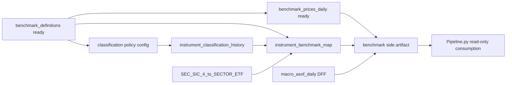

# Benchmark Architecture First Compliant Checklist

Repo-local canonical working checklist on `E:` for the first compliant benchmark-mapping implementation. This file supersedes the external Cursor-hosted plan as the active working plan for benchmark architecture work in this repo.

**Normative combined directive (benchmark + factor diagnostics):** `docs/COMBINED_IMPLEMENTATION_DIRECTIVE_v1.md`.

**Separate track (not the benchmark engine):** Cross-sectional factor diagnostics use **alphalens-reloaded** under `analysis/alpha_diagnostics/`; see directive **A** and implementation plan **Task 8**.

## Repo-Specific Starting Point

The repo already contains partial benchmark infrastructure that this checklist must harden rather than replace from scratch:

- `configs/benchmarks.yaml` already defines benchmark and context symbols, but the current semantics are still expressed through legacy fields rather than the final directive vocabulary.
- `market_data/silver/build_benchmark_definitions.py` already builds `benchmark_definitions`, but that surface still needs **`benchmark_id`** (stable key), stricter role validation (sole primary **SPY**, eleven sector ETFs, **^VIX**/**VIXY** context), and coordinated tests/docs.
- `market_data/silver/build_benchmark_prices_daily.py` already writes the **sid-keyed silver** `benchmark_prices_daily` shape (aligned to `prices_1d_unadjusted`). The **canonical live** contract is **unadjusted OHLCV**—**no `adj_close`** on this table; adjusted/total-return semantics belong in a **separate derived return surface** (directive B6–B7).
- `market_data/common/schema_registry.py` and `market_data/common/pandera_contracts.py` already register `instrument_classification_history` and `instrument_benchmark_map`, but both are still documented as deferred in current repo docs and verification.
- `docs/data_contract.md` and `README.md` currently still describe `instrument_classification_history` and `instrument_benchmark_map` as deferred and do not yet reflect the first compliant implementation.
- `configs/macro_series.yaml` already includes `DFF`, which means the risk-free leg can remain macro-native without polluting OHLCV benchmark semantics.
- `Pipeline.py` currently uses the word `benchmark` in statistical and baseline-reporting contexts that are semantically different from economic market benchmarks. Those meanings must remain clearly separated.

## Prerequisite Migrations Before Classification Mapping

This checklist is centered on classification and benchmark mapping, but the repo also has prerequisite benchmark-surface work that must be aligned before the mapping layer can be considered complete:

### 1. Benchmark registry readiness

Before mapping builders rely on benchmark definitions:

- confirm `benchmark_definitions` exposes stable identifiers that `instrument_benchmark_map` can reference deterministically
- confirm only one canonical market benchmark is primary: `SPY`
- confirm the 11 sector ETFs are the only canonical sector layer
- confirm context series remain context-only
- confirm `DFF` is absent from the OHLCV benchmark registry

### 2. Benchmark price surface readiness

Before downstream benchmark artifacts are exported:

- confirm `benchmark_prices_daily` remains a canonical **sid-keyed** slice of `prices_1d_unadjusted` (silver shape)
- confirm **return basis** is explicit for any derived return series (unadjusted close-to-close vs adjusted total return, etc.); **do not** add `adj_close` to the canonical unadjusted silver benchmark price contract
- confirm adjusted/total-return needs are satisfied via a **separate** derived artifact (e.g. `benchmark_return_surface_daily`), not by mutating the live silver OHLCV contract
- confirm the price surface does not embed instrument assignment logic

### 3. Deferred-to-active contract transition

When the first compliant implementation lands:

- `instrument_classification_history` and `instrument_benchmark_map` must move from deferred wording to active implemented surfaces in docs and verification
- validation must become fail-closed for overlap, invalid mapping, or missing required benchmark coverage
- downstream sector-relative logic may only activate when those active canonical surfaces are actually present

## Frozen Source Policy

- Authoritative classification source: SEC EDGAR / XBRL DEI Primary SIC
- Classification system: `SEC_SIC_4`
- Market benchmark: `SPY`
- Sector benchmark layer: 11 sector ETFs
- Risk-free source: `DFF` on the macro path only

## Required New Artifacts

### New config and mapping assets

1. `configs/classification_sources.yaml`
2. `configs/sec_sic4_to_sector_etf.yaml`

### New builders

3. `market_data/silver/build_instrument_classification_history.py`
4. `market_data/silver/build_instrument_benchmark_map.py`

### New or extended validators and tests

5. Extend `tools/verify_market_data_contracts.py`
6. Add tests under `tests/market_data/`

### Optional helper module

7. `market_data/common/classification.py`

This helper is not strictly mandatory, but it is the cleanest place for shared classification parsing, mapping, and windowing logic.

## File-by-File Work

## Execution Order In This Repo

Use this dependency order in the actual repo, even if some benchmark registry work already exists:



### A. `configs/classification_sources.yaml`

Purpose:
Freeze the source policy so the builder does not embed source assumptions in code.

Add a minimal config like:

```yaml
classification_sources:
  primary:
    source_name: SEC_EDGAR_XBRL
    classification_system: SEC_SIC_4
    field_precedence:
      - dei:EntityPrimarySicNumber
      - filing_header_sic
    effective_from_policy: filing_acceptance_or_filing_date
    missing_policy: keep_missing
```

Requirements:

- Must clearly identify the authoritative source
- Must declare `classification_system = SEC_SIC_4`
- Must define precedence order for SIC extraction
- Must define the missing-data policy

Acceptance:

- Config loads with no defaults silently injected
- Config mismatch fails closed

### B. `configs/sec_sic4_to_sector_etf.yaml`

Purpose:
Versioned, repo-owned crosswalk from SIC to one of the 11 canonical sector ETFs.

Add a structure like:

```yaml
mapping_rule_version: 1
classification_system: SEC_SIC_4
mappings:
  "1311": XLE
  "1389": XLE
  "2834": XLV
  "3571": XLK
  "6021": XLF
```

In practice this will likely need broader coverage than a few leaf codes. A clean structure may support:

- exact SIC4 override
- optional SIC2 or SIC3 family fallback
- explicit unmapped state

Required fields:

- `mapping_rule_version`
- `classification_system`
- mapping entries
- optional notes/comments field

Rules:

- Every mapped target must be one of:
  `XLC XLY XLP XLE XLF XLV XLI XLB XLRE XLK XLU`
- No target may point to context tickers
- No target may be blank unless intentionally left unmapped

Acceptance:

- Parser rejects invalid ETF symbols
- Parser rejects duplicate conflicting mappings
- Mapping version must be populated

Critical caution:
This is the weakest semantic layer in the first compliant implementation. Be explicit where mapping is approximate. Do not pretend SIC is naturally identical to GICS.

### C. `market_data/common/classification.py`

Purpose:
Centralize classification parsing and mapping logic so it is not duplicated across builders and tests.

Add functions:

- `load_classification_source_policy()`
- `load_sec_sic_crosswalk()`
- `normalize_sic_code(raw_value) -> str | None`
- `resolve_sector_etf_from_sic(sic_code, crosswalk) -> str | None`
- `build_effective_windows(observations_df) -> DataFrame`
- `validate_non_overlapping_windows(df) -> None`

Rules:

- Normalize SIC to a strict canonical string format
- Reject malformed SIC instead of coercing aggressively
- All date-window logic should be deterministic
- Window generation should be independently testable from I/O

Acceptance:

- Helper functions have focused unit tests
- Builders do not reimplement window logic locally

### D. `market_data/silver/build_instrument_classification_history.py`

Purpose:
Build the authoritative date-effective classification table.

Inputs:

- instrument universe / instrument master
- symbol to issuer to CIK mapping
- EDGAR filing metadata and/or XBRL DEI extraction results
- `configs/classification_sources.yaml`

Output:

- `instrument_classification_history`

Required fields:

- `instrument_id`
- `classification_system`
- `sector_code`
- `sector_name`
- `effective_from`
- `effective_to`
- `source`
- `source_reference`
- `asof_timestamp`

Build logic:

1. Resolve identity:
   - Map each eligible U.S. equity instrument to issuer / CIK
   - Fail clearly on ambiguous identity
   - Keep unresolved rows out of authoritative classification output
2. Collect authoritative observations:
   - Gather SIC evidence from SEC / XBRL source
   - Use source precedence from config
   - Retain evidence date, filing timestamp, and source reference
3. Normalize SIC:
   - Canonicalize into `SEC_SIC_4`
   - Reject malformed or blank values
   - Preserve raw evidence separately if useful for audit
4. Derive sector metadata:
   - `sector_code`: mapped ETF symbol or a canonical sector code string
   - `sector_name`: canonical sector label aligned to the mapped ETF
   - Preferred first implementation: `sector_code = XLE / XLK / ...` and `sector_name = Energy / Information Technology / ...`
5. Build effective windows:
   - Sort authoritative observations by effective timestamp
   - Collapse consecutive identical classifications where appropriate
   - Generate non-overlapping windows
   - Use half-open interval semantics internally if practical
6. Write silver artifact:
   - Validate against contract before write
   - Record build metadata / manifest entry

Missing-data policy:

- When no authoritative SIC evidence exists, write nothing for that window
- Do not synthesize a row
- Do not backfill from present-day vendor profiles

Acceptance:

- Table builds deterministically
- Windows do not overlap
- `classification_system` always equals `SEC_SIC_4`
- Every row traces back to SEC evidence
- No current-profile inference contaminates history

### E. `market_data/silver/build_instrument_benchmark_map.py`

Purpose:
Build the canonical instrument-to-benchmark assignment table.

Inputs:

- `instrument_classification_history`
- benchmark registry / benchmark definitions
- `configs/sec_sic4_to_sector_etf.yaml`
- eligible equity universe

Output:

- `instrument_benchmark_map`

Required fields:

- `instrument_id`
- `effective_from`
- `effective_to`
- `market_benchmark_id`
- `sector_benchmark_id`
- `mapping_rule_version`
- `mapping_source`
- `asof_timestamp`

Build logic:

1. Assign market benchmark:
   - For every eligible equity, `market_benchmark_id = SPY`
   - This must not depend on classification
2. Assign sector benchmark:
   - Read canonical sector assignment
   - Resolve target sector ETF
   - Map to benchmark registry ID, not just raw symbol
3. Handle missing classification:
   - Preferred design is an explicit row with `market_benchmark_id = SPY` and `sector_benchmark_id = NULL`
4. Write versioned mapping:
   - `mapping_rule_version` comes from the crosswalk config
   - `mapping_source = SEC_SIC_4_to_SECTOR_ETF`

Acceptance:

- Every eligible equity has market mapping
- Sector mapping only exists where authoritative classification supports it
- Mapping windows are non-overlapping
- Mapping is reproducible from classification plus crosswalk only

Repo-specific note:

- This builder must resolve benchmark registry IDs from canonical benchmark definitions rather than hard-coding raw ETF symbols into downstream mapping output.

### F. `market_data/common/schema_registry.py`

Purpose:
Ensure schema definitions match the long-term directive.

Review or update:

- `INSTRUMENT_CLASSIFICATION_HISTORY_*`
- `INSTRUMENT_BENCHMARK_MAP_*`

Check specifically:

- `source_reference` exists or add it
- `mapping_rule_version` exists
- Nullability of `sector_benchmark_id` allows missing authoritative classification
- Date/time field semantics are unambiguous

Acceptance:

- Schema allows the honest missing-classification state
- Schema does not force fake sector mapping

Repo-specific note:

- If current field names still use `_date` or legacy created/loaded timestamps, the implementation should align names and timestamp semantics across schema, builders, verifiers, and docs rather than silently mixing old and new terminology.

### G. `market_data/common/pandera_contracts.py`

Purpose:
Make contract-level rules executable.

Add or confirm checks for `instrument_classification_history`:

- Required columns present
- `classification_system == "SEC_SIC_4"`
- `effective_from < effective_to` where `effective_to` is not null
- No overlapping windows per `instrument_id`
- `sector_code` valid
- `sector_name` valid for `sector_code`

Add or confirm checks for `instrument_benchmark_map`:

- Required columns present
- `market_benchmark_id` not null
- `market_benchmark_id == SPY` benchmark registry ID
- `sector_benchmark_id` either null or one of the canonical 11 sector benchmark IDs
- No overlapping windows per `instrument_id`
- `mapping_rule_version` populated

Acceptance:

- Contract failures are hard failures
- There is no warning-only path for PIT window violations

Repo-specific note:

- Once the first compliant implementation is active, contract status for `instrument_classification_history` and `instrument_benchmark_map` should no longer remain effectively deferred in user-facing docs or verifier expectations.

### H. `tools/verify_market_data_contracts.py`

Purpose:
Upgrade verification from table existence checks to compliance checks.

Extend `_validate_classification_incremental` to check:

- table exists
- schema valid
- non-overlap
- allowed classification system only
- source fields populated
- no impossible date ordering

Extend `_validate_benchmark_map_incremental` to check:

- table exists
- schema valid
- every eligible equity has `SPY` market mapping coverage
- sector benchmark IDs valid when present
- null sector mapping only appears under documented missing-classification conditions

Add cross-table validation:

- every non-null `sector_benchmark_id` corresponds to classification-supported rows
- mapping windows do not extend beyond classification support incorrectly
- benchmark IDs exist in the benchmark registry

Acceptance:

- Verifier fails closed on broken mappings
- Verifier output names the offending table, key, and date range

### I. `market_data/orchestration/run_all.py`

Purpose:
Wire the new builders into the canonical orchestration flow.

Required order:

1. benchmark definitions
2. benchmark prices
3. classification history
4. benchmark map
5. export artifact(s)
6. contract verification

Requirements:

- Classification builder runs before benchmark map builder
- Downstream export does not silently skip missing mandatory artifacts in compliant mode

Acceptance:

- Clean unattended build order
- Manifest includes both new artifacts
- Failure surfaces are explicit

Repo-specific note:

- `run_all.py` should treat classification history and benchmark map as canonical build surfaces once implemented, not as optional side tables.

### J. `market_data/bridge/export_pipeline_panel.py`

Purpose:
Expose benchmark artifacts to downstream consumers without bloating the core panel.

Add a benchmark side artifact, preferably Parquet.

Recommended output:

- `benchmark_surface_daily.parquet`

Minimum columns:

- `date`
- `spy_ret_1d`
- `dff_daily_rate`
- optionally sector ETF return columns such as:
  - `xlc_ret_1d`
  - `xly_ret_1d`
  - and others

Better separation:

Keep two exports:

1. market / sector / risk-free surface
2. instrument benchmark map surface

Acceptance:

- Core panel contract remains unchanged unless intentionally revised
- Pipeline can load benchmark surfaces deterministically

Repo-specific note:

- The export layer should remain compatibility-preserving for `panel_ohlcv_clean.csv`; benchmark outputs should be discoverable through a fixed path or manifest rather than by teaching `Pipeline.py` to infer benchmark files ad hoc.

### K. `Pipeline.py`

Purpose:
Consume, not define, benchmark semantics.

Add in first compliant mode:

- load SPY daily series from the benchmark export artifact
- optionally load DFF daily rate
- compute evaluation/report diagnostics

Allowed now:

- active return vs SPY
- tracking error
- information ratio
- beta/correlation
- optional excess-return stats using DFF

Allowed after mapping exists:

- sector-relative evaluation
- benchmark decomposition
- optional benchmark-relative features

Forbidden:

- infer sector ETF from current metadata
- rebuild benchmark mapping locally
- read raw SEC classification directly

Acceptance:

- benchmark mode runs from canonical export only
- failure is explicit when a required artifact is missing

Repo-specific note:

- Existing statistical uses of the word `benchmark` in `Pipeline.py` should be clarified where necessary so they are not confused with economic benchmark artifacts like `SPY` or sector ETFs.

### L. `README.md`

Purpose:
Prevent semantic confusion.

Add or update sections for:

- canonical benchmark categories
- authoritative classification source policy
- first compliant implementation limitations
- SIC-to-sector ETF mapping as an approximation layer
- sector-relative support requiring canonical mapping artifacts

Acceptance:

- README does not claim true GICS history if not implemented
- README does not imply sector-relative validity without mapping

Repo-specific note:

- README should explicitly state that SEC SIC to sector ETF is a first compliant approximation layer, not a licensed historical GICS substitute.

### M. `docs/data_contract.md`

Purpose:
Freeze semantics and contract boundaries.

Add or update:

- definitions for `instrument_classification_history`
- definitions for `instrument_benchmark_map`
- definitions for `benchmark_surface_daily`
- market vs sector vs risk-free semantics

Explicit policies:

- `DFF` remains macro-native
- `SPY` is the universal market benchmark
- sector mapping derives from `SEC_SIC_4`
- missing authoritative classification yields null sector benchmark
- present-day backfill is forbidden

Acceptance:

- Doc and validator semantics match exactly
- No stale `deferred` language remains once implementation is active

Repo-specific note:

- `docs/data_contract.md` should explicitly define the transition from deferred semantics to active canonical semantics for the two new implemented surfaces.

### N. `market_data/COMMANDS.md`

Purpose:
Make the build reproducible operationally.

Add commands for:

- classification history build
- benchmark map build
- full benchmark verification
- export artifact generation

Example structure:

```bash
python -m market_data.silver.build_instrument_classification_history
python -m market_data.silver.build_instrument_benchmark_map
python -m market_data.bridge.export_pipeline_panel
python tools/verify_market_data_contracts.py
```

Acceptance:

- Commands are copy-paste ready
- Commands match actual module paths

## Test Plan

Add these tests under `tests/market_data/`.

### A. `test_classification_source_policy.py`

Check:

- config loads
- source precedence honored
- invalid source config fails

### B. `test_sec_sic_crosswalk.py`

Check:

- mapping file loads
- invalid ETF target rejected
- duplicate conflicting entries rejected
- version required

### C. `test_build_instrument_classification_history.py`

Check:

- SIC normalization works
- multiple observations create correct windows
- identical consecutive SIC values collapse properly
- malformed SIC rejected
- missing authoritative evidence does not fabricate rows

### D. `test_build_instrument_benchmark_map.py`

Check:

- every eligible equity gets `SPY`
- valid SIC maps to the correct sector ETF
- missing classification yields null sector benchmark
- windows align with classification windows
- mapping rule version propagated

### E. `test_verify_market_data_contracts_benchmark_mapping.py`

Check:

- overlapping windows fail
- invalid sector benchmark ID fails
- missing SPY market mapping fails
- mapping without corresponding benchmark definition fails

### F. `test_pipeline_benchmark_consumption.py`

Check:

- pipeline loads side artifact
- benchmark diagnostics populate
- missing artifact fails clearly
- sector-relative mode activates only when mapping is present

## Repo-Level Acceptance Tests

The first compliant implementation is done only when all of these are true:

1. `instrument_classification_history` builds from SEC evidence.
2. `classification_system` is always `SEC_SIC_4`.
3. classification windows are non-overlapping.
4. `instrument_benchmark_map` builds deterministically.
5. every eligible U.S. equity has `market_benchmark_id = SPY`.
6. sector benchmark mapping comes only from canonical classification plus repo crosswalk.
7. rows with no authoritative classification have `sector_benchmark_id = NULL`.
8. benchmark export artifact exists and is discoverable.
9. `Pipeline.py` consumes benchmark artifacts without local benchmark inference.
10. docs, commands, and verification logic all match the implemented semantics.

## Additional Repo-Specific Acceptance Conditions

- `benchmark_definitions` is usable as the sole benchmark authority for ID resolution in the mapping builder.
- `benchmark_prices_daily` is aligned with the benchmark export artifact requirements rather than remaining only a legacy benchmark slice.
- `docs/data_contract.md`, `README.md`, and `market_data/COMMANDS.md` all stop describing classification and benchmark mapping as merely deferred once the implementation is active.
- The repo does not claim sector-relative validity anywhere until canonical mapping artifacts actually build and verify successfully.

## Required Implementation Order

Use this order exactly.

### Phase 1

- `configs/classification_sources.yaml`
- `configs/sec_sic4_to_sector_etf.yaml`
- `market_data/common/classification.py`

### Phase 2

- `build_instrument_classification_history.py`
- schema and contract updates
- unit tests for classification history

### Phase 3

- `build_instrument_benchmark_map.py`
- verifier extensions
- mapping tests

### Phase 4

- benchmark export side artifact
- pipeline read-only consumption
- pipeline tests

### Phase 5

- `README.md`
- `docs/data_contract.md`
- `market_data/COMMANDS.md`
- final repo-level acceptance verification

## Non-Negotiable Rules

### Do

- Keep `DFF` on the macro path
- Keep `SPY` universal as market benchmark
- Allow null sector benchmark when classification is missing
- Version the SIC crosswalk
- Fail closed on overlap or invalid mapping

### Do not

- Use current vendor profile sector as historical truth
- Guess sector from company description
- Hard-code present-day sector membership for all dates
- Put `DFF` into OHLCV benchmark registry
- Compute sector benchmark assignment inside `Pipeline.py`
- Leave benchmark ID resolution implicit or dependent on unstated registry assumptions
- Keep relying on C-drive plan files for active repo planning when a repo-local E-drive markdown plan exists

## Tight Implementation Brief

```text
Implement the first compliant benchmark-mapping layer for the repo.

Source policy:
- Authoritative classification source = SEC EDGAR / XBRL DEI Primary SIC
- classification_system = SEC_SIC_4
- sector mapping source = repo-owned versioned SEC_SIC_4_to_SECTOR_ETF crosswalk
- market benchmark = SPY for all eligible U.S. equities
- risk-free source = DFF on the macro path only

Build and validate:
1. configs/classification_sources.yaml
2. configs/sec_sic4_to_sector_etf.yaml
3. market_data/common/classification.py
4. market_data/silver/build_instrument_classification_history.py
5. market_data/silver/build_instrument_benchmark_map.py
6. extend schema/contracts/verifiers/tests
7. export a benchmark side artifact for Pipeline.py

Required behavior:
- instrument_classification_history is built only from authoritative SEC filing-time evidence
- classification windows are non-overlapping
- instrument_benchmark_map assigns SPY to every eligible equity
- sector_benchmark_id is mapped from canonical classification where authoritative SIC exists, else NULL
- DFF remains macro-native and outside OHLCV benchmark registry
- Pipeline.py consumes canonical benchmark artifacts only and performs no local benchmark inference

Fail closed on:
- overlapping windows
- invalid ETF targets
- missing mapping_rule_version
- fabricated sector history
- use of current profile sector as historical truth
```
